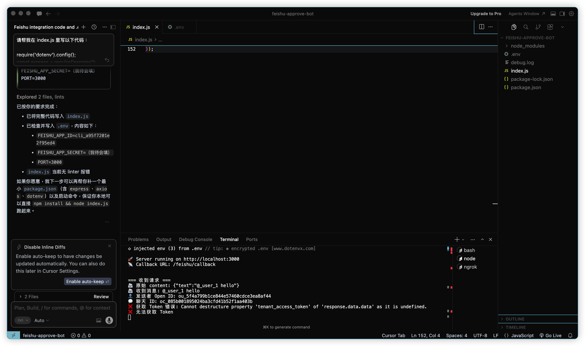

# 随心拍素材库 自动下载脚本

自动检测随心拍素材库的新图片/视频，下载到本地并按分类整理好文件夹。

## 前置要求

### 安装 Node.js

1. 打开 [https://nodejs.org](https://nodejs.org)
2. 点击 **LTS** 版本下载（推荐稳定版）
3. 打开下载的安装包，一路点 Continue / Install 完成安装
4. 打开 Terminal，输入以下命令确认安装成功：
   ```bash
   node -v
   ```
   看到版本号（如 `v20.x.x`）即表示安装成功。

> 仅需 Node.js，不需要 Cursor 或任何编辑器。无需 `npm install`，脚本只使用 Node.js 内建模块。

## 快速开始

1. 下载仓库里的 `downloader.js`、`config.json`、`package.json` 三个文件到同一个文件夹

2. 在同一个文件夹新建 `.env` 文件，填入你的 session cookie：
   ```
   PHPSESSID=你的PHPSESSID值
   ```

3. 打开 Terminal，进入该文件夹，执行：
   ```bash
   # 执行一次（下载所有新文件）
   node downloader.js

   # 持续监控模式（每 N 分钟自动检查新文件）
   node downloader.js --watch
   ```

下载的文件会自动按分类整理到 `downloads/` 文件夹下。

## 如何获取 PHPSESSID

> 需要先安装 [Proxyman](https://proxyman.io/download)（网络抓包工具）

1. 打开 **Proxyman**，确保 SSL 解密已开启
2. 打开钉钉，进入「随心拍素材库」小程序，随便滚动一下列表
3. 在 Proxyman 里找到 `xinzhi.aimei.group` 的请求
4. 点击那个请求 → 切换到 **Cookies** 标签
5. 复制 `PHPSESSID` 对应的值



然后更新本地的 `.env` 文件：

```
PHPSESSID=你复制的新值
```

> Session 过期后脚本会提示 `⚠️ Session 已过期`，重新抓一次 Proxyman 更新 `.env` 即可，已下载的文件不会重复下载。

## 文件说明

- `downloader.js` — 主脚本
- `config.json` — 配置（轮询间隔、下载目录等）
- `.env` — 存放 PHPSESSID（不会上传到 GitHub）
- `state.json` — 自动生成，记录已下载的文件 ID
- `downloads/` — 自动生成，按分类整理的下载目录
